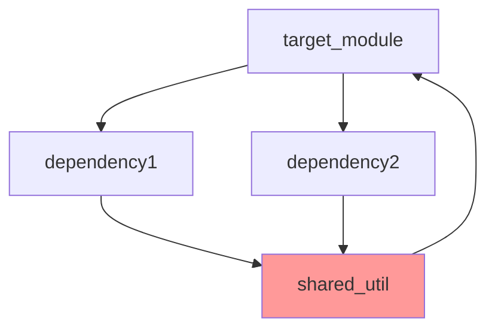

# REFACTORING ANALYSIS REPORT

**Generated**: DD-MM-YYYY HH:MM:SS
**Target File(s)**: [files to refactor]
**Analyst**: Claude Refactoring Specialist
**Report ID**: refactor\_[target]\_DD-MM-YYYY_HHMMSS

## EXECUTIVE SUMMARY

[High-level overview of refactoring scope and benefits]

## CODEBASE-WIDE CONTEXT (if Phase 0 was executed)

### Related Files Discovery

- **Target file imported by**: X files [list key dependents]
- **Target file imports**: Y modules [list key dependencies]
- **Tightly coupled modules**: [list files with high coupling]
- **Circular dependencies detected**: [Yes/No - list if any]

### Additional Refactoring Candidates

| Priority | File     | Lines | Complexity | Reason                          |
| -------- | -------- | ----- | ---------- | ------------------------------- |
| HIGH     | file1.py | 2000  | 35         | God object, imports target      |
| HIGH     | file2.py | 1500  | 30         | Circular dependency with target |
| MEDIUM   | file3.py | 800   | 25         | High coupling, similar patterns |

### Recommended Approach

- **Refactoring Strategy**: [single-file | multi-file | modular]
- **Rationale**: [explanation of why this approach is recommended]
- **Additional files to include**: [list if multi-file approach]

## CURRENT STATE ANALYSIS

### File Metrics Summary Table

| Metric         | Value | Target | Status |
| -------------- | ----- | ------ | ------ |
| Total Lines    | X     | <500   | ⚠️     |
| Functions      | Y     | <20    | ✅     |
| Classes        | Z     | <10    | ⚠️     |
| Avg Complexity | N     | <15    | ❌     |

### Code Smell Analysis

| Code Smell     | Count | Severity | Examples                         |
| -------------- | ----- | -------- | -------------------------------- |
| Long Methods   | X     | HIGH     | function_a (125 lines)           |
| God Classes    | Y     | CRITICAL | ClassX (25 methods)              |
| Duplicate Code | Z     | MEDIUM   | Lines 145-180 similar to 450-485 |

### Test Coverage Analysis

| File/Module | Coverage | Missing Lines    | Critical Gaps   |
| ----------- | -------- | ---------------- | --------------- |
| module.py   | 45%      | 125-180, 200-250 | auth_function() |
| utils.py    | 78%      | 340-360          | None            |

### Complexity Analysis

| Function/Class    | Lines | Cyclomatic | Cognitive | Parameters | Nesting | Risk     |
| ----------------- | ----- | ---------- | --------- | ---------- | ------- | -------- |
| calculate_total() | 125   | 45         | 68        | 8          | 6       | CRITICAL |
| DataProcessor     | 850   | -          | -         | -          | -       | HIGH     |
| validate_input()  | 78    | 18         | 32        | 5          | 4       | HIGH     |

### Dependency Analysis

| Module   | Imports From | Imported By | Coupling | Risk |
| -------- | ------------ | ----------- | -------- | ---- |
| utils.py | 12 modules   | 25 modules  | HIGH     | ⚠️   |

### Performance Baselines

| Metric       | Current | Target | Notes                  |
| ------------ | ------- | ------ | ---------------------- |
| Import Time  | 1.2s    | <0.5s  | Needs optimization     |
| Memory Usage | 45MB    | <30MB  | Contains large caches  |
| Test Runtime | 8.5s    | <5s    | Slow integration tests |

## REFACTORING PLAN

### Phase 1: Test Coverage Establishment

#### Tasks (To Be Done During Execution):

1. Would need to write unit tests for `calculate_total()` function
2. Would need to add integration tests for `DataProcessor` class
3. Would need to create test fixtures for complex scenarios

#### Estimated Time: 2 days

**Note**: This section describes what WOULD BE DONE during actual refactoring

### Phase 2: Initial Extractions

#### Task 1: Extract calculation logic

- **Source**: main.py lines 145-205
- **Target**: calculations/total_calculator.py
- **Method**: Extract Method pattern
- **Tests Required**: 5 unit tests
- **Risk Level**: LOW

[Continue with detailed extraction plans...]

## RISK ASSESSMENT

### Risk Matrix

| Risk                       | Likelihood | Impact | Score | Mitigation                     |
| -------------------------- | ---------- | ------ | ----- | ------------------------------ |
| Breaking API compatibility | Medium     | High   | 6     | Facade pattern, versioning     |
| Performance degradation    | Low        | Medium | 3     | Benchmark before/after         |
| Circular dependencies      | Medium     | High   | 6     | Dependency analysis first      |
| Test coverage gaps         | High       | High   | 9     | Write tests before refactoring |

### Technical Risks

- **Risk 1**: Breaking API compatibility
  - Mitigation: Maintain facade pattern
  - Likelihood: Medium
  - Impact: High

### Timeline Risks

- Total Estimated Time: 10 days
- Critical Path: Test coverage → Core extractions
- Buffer Required: +30% (3 days)

## IMPLEMENTATION CHECKLIST

```json
// TodoWrite compatible task list
[
  {
    "id": "1",
    "content": "Review and approve refactoring plan",
    "priority": "high"
  },
  {
    "id": "2",
    "content": "Create backup files in backup_temp/ directory",
    "priority": "critical"
  },
  {
    "id": "3",
    "content": "Set up feature branch 'refactor/[target]'",
    "priority": "high"
  },
  {
    "id": "4",
    "content": "Establish test baseline - 85% coverage",
    "priority": "high"
  },
  {
    "id": "5",
    "content": "Execute planned refactoring extractions",
    "priority": "high"
  },
  {
    "id": "6",
    "content": "Validate all tests pass after refactoring",
    "priority": "high"
  },
  {
    "id": "7",
    "content": "Update project documentation (README, architecture)",
    "priority": "medium"
  },
  {
    "id": "8",
    "content": "Verify documentation accuracy and consistency",
    "priority": "medium"
  }
  // ... complete task list
]
```

## POST-REFACTORING DOCUMENTATION UPDATES

### 7.1 MANDATORY Documentation Updates (After Successful Refactoring)

**CRITICAL**: Once refactoring is complete and validated, update project documentation:

**README.md Updates**:

- Update project structure tree to reflect new modular organization
- Modify any architecture diagrams or component descriptions
- Update installation/setup instructions if module structure changed
- Revise examples that reference refactored files/modules

**Architecture Documentation Updates**:

- Update any ARCHITECTURE.md, DESIGN.md, or similar files only if they exist. Do not create them if they don't already exist.
- Modify module organization sections in project documentation
- Update import/dependency diagrams
- Revise developer onboarding guides

**Project-Specific Documentation**:

- Look for project-specific documentation files (CLAUDE.md, CONTRIBUTING.md, etc.). Do not create them if they don't already exist.
- Update any module reference tables or component lists
- Modify file organization sections
- Update any internal documentation references

**Documentation Update Checklist**:

```markdown
- [ ] README.md project structure updated
- [ ] Architecture documentation reflects new modules
- [ ] Import/dependency references updated
- [ ] Developer guides reflect new organization
- [ ] Project-specific docs updated (if applicable)
- [ ] Examples and code snippets updated
- [ ] Module reference tables updated
```

**Documentation Consistency Verification**:

- Ensure all file paths in documentation are accurate
- Verify import statements in examples are correct
- Check that module descriptions match actual implementation
- Validate that architecture diagrams reflect reality

### 7.2 Version Control Documentation

**Commit Message Template**:

```
refactor: [brief description of refactoring]

- Extracted [X] modules from [original file]
- Reduced complexity from [before] to [after]
- Maintained 100% backward compatibility
- Updated documentation to reflect new structure

Files changed: [list key files]
New modules: [list new modules]
Backup location: backup_temp/[files]
```

## SUCCESS METRICS

- [ ] All tests passing after each extraction
- [ ] Code coverage ≥ 85%
- [ ] No performance degradation
- [ ] Cyclomatic complexity < 15
- [ ] File sizes < 500 lines
- [ ] Documentation updated and accurate
- [ ] Backup files created and verified

## APPENDICES

### A. Complexity Analysis Details

**Function-Level Metrics**:

```
function_name(params):
  - Physical Lines: X
  - Logical Lines: Y
  - Cyclomatic: Z
  - Cognitive: N
  - Decision Points: A
  - Exit Points: B
```

### B. Dependency Graph



Note: Circular dependency detected (highlighted in red)

### C. Test Plan Details

**Test Coverage Requirements**:
| Component | Current | Required | New Tests Needed |
|-----------|---------|----------|------------------|
| Module A | 45% | 85% | 15 unit, 5 integration |
| Module B | 0% | 80% | 25 unit, 8 integration |

### D. Code Examples

**BEFORE (current state)**:

```python
def complex_function(data, config, user, session, cache, logger):
    # 125 lines of nested logic
    if data:
        for item in data:
            if item.type == 'A':
                # 30 lines of processing
            elif item.type == 'B':
                # 40 lines of processing
```

**AFTER (refactored)**:

```python
def process_data(data: List[Item], context: ProcessContext):
    """Process data items by type."""
    for item in data:
        processor = get_processor(item.type)
        processor.process(item, context)

class ProcessContext:
    """Encapsulates processing dependencies."""
    def __init__(self, config, user, session, cache, logger):
        self.config = config
        # ...
```

---

_This report serves as a comprehensive guide for refactoring execution.
Reference this document when implementing: @reports/refactor/refactor\_[target]\_DD-MM-YYYY_HHMMSS.md_
