# Diagnose Entity Availability

Systematically investigate why an episode, show, or audiobook is not available or playable for a user. Makes live calls to Spotify backend services via dynamo-mcp and dispatches parallel subagent teams to minimize investigation time.

**Dependencies:** dynamo-mcp (must be configured), spotify-user-lookup skill (for user resolution)

## When to Use

- "Why can't user X play episode Y?"
- "Episode/show/audiobook not available in market Z"
- "Padlock showing on episode"
- "Metadata says playable but audio won't play"
- "Episode/show not found or missing"
- "Audiobook says listening hours exceeded"
- Any entity availability or playability investigation

## When NOT to Use

- **Music tracks** — different availability system entirely
- **RSS feed / ingestion issues** — see `statements-platform-services/statements-library/docs/operations/debugging-missing-episode-or-show.md`
- **Service outages** — check Grafana/alerts first, this skill diagnoses per-entity issues

## Input Gathering

### Required

- **Entity URI** — `spotify:episode:...`, `spotify:show:...`, `spotify:audiobook:...`, or `spotify:audiobookchapter:...`

### Optional (auto-enrich when provided)

- **User identifier** — user ID, username, or email. Invoke `spotify-user-lookup` to resolve canonical user_id, country, catalogue, and employee status. Do NOT ask the user for country/catalogue separately — resolve it.
- **Symptom** — if not described, ask:
  1. Entity not found / missing entirely
  2. Entity visible but can't play (padlock, locked, greyed out)
  3. Entity not visible in search / browse
  4. Metadata says playable but audio/video won't actually play
  5. Not available in a specific market
  6. Audiobook says "listening hours exceeded"
  7. Not sure / something else

### URI Rewriting

Rewrite before any service calls:

| Input URI                     | Rewrite To           | API                       |
| ----------------------------- | -------------------- | ------------------------- |
| `spotify:episode:ID`          | (keep)               | episode-api `GetEpisodes` |
| `spotify:show:ID`             | (keep)               | show-api `GetShows`       |
| `spotify:audiobook:ID`        | `spotify:show:ID`    | show-api `GetShows`       |
| `spotify:audiobookchapter:ID` | `spotify:episode:ID` | episode-api `GetEpisodes` |

**CRITICAL: Never assume podcast vs audiobook from the URI.** A `spotify:episode:` can be a podcast episode OR audiobook chapter. A `spotify:show:` can be a podcast OR audiobook. The triage call's `content_type` is the source of truth:

- `PODCAST` → podcast episode
- `CHAPTER` → audiobook chapter
- `PODCAST_SHORT` → podcast short
- `LESSON` → learning content
- `USER_HIGHLIGHT` → user highlight

Content type determines which Casys namespaces matter, whether consumption capping applies, and which rules are active.

## Phase 1: Triage (always runs first)

One call to get the lay of the land. This determines which subagent branches to spawn.

**For episode/audiobookchapter URIs:**

```json
dynamo_call_method:
  target: "episode-api"
  package: "spotify.metadata.episode.v1"
  service: "EpisodeApi"
  method: "GetEpisodes"
  payload: {
    "episode_uris": [{"uri": "<URI>"}],
    "requested_fields": {
      "paths": ["availability", "playability", "audience_reach",
                "authorization_groups", "content_type",
                "content_authorization_attributes", "name",
                "show_uri", "episode_type"]
    },
    "request_metadata": {
      "user_info": {
        "user_id": "<user_id>",
        "market_country_iso": "<country>",
        "catalogue": "<catalogue>",
        "is_employee": false
      },
      "component_id": "diagnose-entity-availability"
    }
  }
  user_info: {"username": "<username>"}
```

**For show/audiobook URIs:**

```json
dynamo_call_method:
  target: "show-api"
  package: "spotify.metadata.show.v1"
  service: "ShowApi"
  method: "GetShows"
  payload: {
    "show_uris": [{"uri": "<URI>"}],
    "requested_fields": {
      "paths": ["availability", "playability", "audience_reach",
                "authorization_groups", "content_type",
                "content_authorization_attributes", "name",
                "show_types", "available_episode_count"]
    },
    "request_metadata": {
      "user_info": {
        "user_id": "<user_id>",
        "market_country_iso": "<country>",
        "catalogue": "<catalogue>",
        "is_employee": false
      },
      "component_id": "diagnose-entity-availability"
    }
  }
  user_info: {"username": "<username>"}
```

**If no user context available**, omit `user_info` from both payload and top-level. The response will still show entity-level data but availability won't be user-specific. Flag this to the user.

**Extract from triage response:**

- `entity_status` — OK, NOT_FOUND, TAKEN_DOWN_FOR_LEGAL_REASONS, PERMISSION_DENIED
- `availability.playability.is_playable` + `restriction_details` with verdicts
- `availability.visibility.is_visible` + `restriction_details` with verdicts
- `audience_reach` — AUDIENCE_REACH_PAYWALL means gated content
- `authorization_groups` — list of `namespace:group_id` strings
- `content_type` — determines podcast vs audiobook behavior
- `name` — for confirming correct entity

**Legacy field gotcha:** `Episode.playability` (top-level, field 22) only indicates **visibility**, not playability, despite its name. Always use `availability.playability` for actual playability.

## Phase 2: Branch Routing

Based on triage result + symptom, determine which subagent teams to spawn. All subagents within a branch run **in parallel** (single message with multiple Agent tool calls).

```dot
digraph routing {
  "Triage result" [shape=diamond];
  "NOT_FOUND" [shape=box, label="Statements + entity-live-status"];
  "TAKEN_DOWN" [shape=box, label="Statements (taken_down flags)"];
  "PERMISSION_DENIED" [shape=box, label="Statements (CCL attributes)"];
  "USER_LACKS_ACCESS" [shape=box, label="Casys + podcast-sub-ext\n+ entity-access-context"];
  "CONSUMPTION_CAPPED" [shape=box, label="Casys (Check + CheckWithoutCapping)\n+ entity-access-context"];
  "COUNTRY_RESTRICTED" [shape=box, label="Statements (sale periods)\n+ availability-api"];
  "CATALOGUE_RESTRICTED" [shape=box, label="Statements (sale periods)\n+ availability-api"];
  "metadata_playback_gap" [shape=box, label="Key2 (DebugService/IsPlayable)\n+ Statements (transcoding)"];
  "unclear" [shape=box, label="Full sweep — ALL agents"];

  "Triage result" -> "NOT_FOUND" [label="entity missing"];
  "Triage result" -> "TAKEN_DOWN" [label="taken down"];
  "Triage result" -> "PERMISSION_DENIED" [label="CCL block"];
  "Triage result" -> "USER_LACKS_ACCESS" [label="visible, not playable\n+ user lacks access"];
  "Triage result" -> "CONSUMPTION_CAPPED" [label="audiobook\n+ capped"];
  "Triage result" -> "COUNTRY_RESTRICTED" [label="country restricted"];
  "Triage result" -> "CATALOGUE_RESTRICTED" [label="catalogue restricted"];
  "Triage result" -> "metadata_playback_gap" [label="playable in metadata\nbut audio won't play"];
  "Triage result" -> "unclear" [label="looks fine / unclear"];
}
```



| Triage Result                                 | Subagents (parallel)                                        | Needs User Context? |
| --------------------------------------------- | ----------------------------------------------------------- | ------------------- |
| `NOT_FOUND` / entity missing                  | Statements + entity-live-status                             | No                  |
| `TAKEN_DOWN_FOR_LEGAL_REASONS`                | Statements                                                  | No                  |
| `PERMISSION_DENIED` (CCL block)               | Statements                                                  | No                  |
| Visible + not playable + `USER_LACKS_ACCESS`  | Casys + podcast-subscription-ext + entity-access-context    | Yes                 |
| Visible + not playable + `CONSUMPTION_CAPPED` | Casys (Check + CheckWithoutCapping) + entity-access-context | Yes                 |
| `COUNTRY_RESTRICTED`                          | Statements (sale periods) + availability-api                | Partial (market)    |
| `CATALOGUE_RESTRICTED`                        | Statements (sale periods) + availability-api                | Partial (catalogue) |
| Playable in metadata but audio won't play     | Key2 + Statements (transcoding/file IDs)                    | Yes                 |
| Everything looks fine / unclear               | ALL agents                                                  | Best effort         |

**If user context is missing for a branch that needs it**, run only the entity-level agents and tell the user what you can't check without a user identifier.

## Phase 3: Subagent Dispatch

Dispatch all agents for the selected branch in a **single message** (parallel execution). Each agent gets a focused prompt with the entity URI, user context, triage results, and content type.

**IMPORTANT:** Each subagent must read `~/.claude/skills/diagnose-entity-availability/service-reference.md` for exact call templates and response field descriptions.

### Statements Agent

**When:** NOT_FOUND, TAKEN_DOWN, PERMISSION_DENIED, COUNTRY/CATALOGUE_RESTRICTED, metadata-playback gap, full sweep

Prompt template:

```
You are investigating why entity <URI> (<name>) is not available.
Content type: <content_type>
User: <user_id> (country: <country>, catalogue: <catalogue>)
Triage result: <summary of triage findings>

Read ~/.claude/skills/diagnose-entity-availability/service-reference.md for exact call templates.

Call statements GetEntity for this URI. Check:
- Does the entity exist in Statements?
- sale periods: which markets/catalogues are allowed? Time windows?
- regional blocks and segment block periods
- taken_down, unpublished flags
- validity (is transcoding complete?)
- authorization_info: is_paywall_content, grants list
- isGatedContent, isEmployeeOnly
- entityLifecycle state
- For metadata-playback gap: check audio/video relation status, file IDs

Report findings as:
{service: "statements", status: "found|not_found|taken_down|...", diagnosis: "<plain language>", evidence: {<key fields and values>}}
```

### Casys Agent

**When:** USER_LACKS_ACCESS, CONSUMPTION_CAPPED, full sweep
**Requires:** User context + authorization_groups from triage

Prompt template:

```
You are checking if user <user_id> has access to entity <URI>.
Content type: <content_type>
Authorization groups from triage: <groups list>

Read ~/.claude/skills/diagnose-entity-availability/service-reference.md for exact call templates.

Call casys Check with the user_id and each authorization group. For audiobooks (content_type=CHAPTER), also call CheckWithoutCapping to distinguish "no access" from "has access but consumption capped."

Check:
- Per-group: Member or NotMember?
- If NotMember: what is the reason? (CONSUMPTION_CAPPED?)
- Which namespace are the groups in? (PODCAST_PAYWALL, AUDIOBOOK_DIRECT_SALES, PREMIUM_AUDIOBOOKS, CONTENT_LINK, CONTENT_ACTIVATE, FEATURE_BUNDLE, etc.)

Report findings as:
{service: "casys", status: "member|not_member|capped", diagnosis: "<plain language>", evidence: {<per-group membership status>}}
```

### Podcast-Subscription-Extension Agent

**When:** USER_LACKS_ACCESS, full sweep

Prompt template:

```
You are checking the subscription/paywall UI status for entity <URI>.
Content type: <content_type>
User: <user_id>

Read ~/.claude/skills/diagnose-entity-availability/service-reference.md for exact call templates.

First, use dynamo_discover to find the podcast-subscription-extension service and its methods. Then call the appropriate method to check:
- is_paywalled (bool)
- is_user_subscribed (bool)
- explanation type (BasicExplanation, UpsellLink, EngagementExplanation, ConsumptionCapped, etc.)
- signifier text (e.g., "Included in Premium")
- What unlock action is available to the user

Report findings as:
{service: "podcast-subscription-extension", status: "subscribed|not_subscribed|not_paywalled", diagnosis: "<plain language>", evidence: {<key fields>}}
```

### Entity-Access-Context Agent

**When:** USER_LACKS_ACCESS, CONSUMPTION_CAPPED, full sweep

Prompt template:

```
You are getting aggregated access context for entity <URI>.
User: <user_id> (country: <country>, catalogue: <catalogue>)

Read ~/.claude/skills/diagnose-entity-availability/service-reference.md for exact call templates.

Call entity-access-context-api:
1. GetManyUserAccessContext (if user_id available) — returns is_gated + how user has/could get access
2. GetManyEntityAccessContext (always) — returns is_gated + what access types are configured

Check:
- is_gated (bool)
- access_types: ANCHOR_PAYWALL, OAP_OTP, OAP_LINKING, DIRECT_SALE, SPOTIFY_SUBSCRIPTION, PROMO_CODE, ENTERPRISE
- Does user have access? Through which type?

Report findings as:
{service: "entity-access-context-api", status: "has_access|no_access|not_gated", diagnosis: "<plain language>", evidence: {<is_gated, access_types, user_access>}}
```

### Entity-Live-Status Agent

**When:** NOT_FOUND, full sweep

Prompt template:

```
You are checking the live/validation status of entity <URI>.
Country: <country>

Read ~/.claude/skills/diagnose-entity-availability/service-reference.md for exact call templates.

Use dynamo_discover to find the entity-live-status service, then call GetLiveStatus with the URI and country code.

Check:
- Does the entity pass validation? (transcoded media exists, non-empty title, etc.)
- What is the live status?

Report findings as:
{service: "entity-live-status", status: "valid|invalid|not_found", diagnosis: "<plain language>", evidence: {<validation details>}}
```

### Availability-API Agent

**When:** COUNTRY_RESTRICTED, CATALOGUE_RESTRICTED, full sweep

Prompt template:

```
You are checking detailed availability restrictions for entity <URI>.
User: <user_id> (country: <country>, catalogue: <catalogue>, is_employee: <bool>)

Read ~/.claude/skills/diagnose-entity-availability/service-reference.md for exact call templates.

Use dynamo_discover to find the availability-api service and its methods, then call GetAvailabilitiesWithUserInfo.

Check:
- playability verdict and details
- visibility verdict and details
- policy_decisions with specific verdicts (VERDICT_COUNTRY_RESTRICTED, VERDICT_CATALOGUE_RESTRICTED, VERDICT_USER_LACKS_ACCESS, VERDICT_UNAVAILABLE)
- access_info

Report findings as:
{service: "availability-api", status: "available|restricted", diagnosis: "<plain language>", evidence: {<verdicts, policy decisions>}}
```

### Key2 Agent (metadata-playback gap only)

**When:** Triage shows playable=true BUT user reports audio/video won't play

Prompt template:

```
You are investigating a metadata-playback gap for entity <URI>.
Triage shows availability.playability.is_playable=true, but the user reports audio/video won't play.
Content type: <content_type>
User: <user_id> (country: <country>, catalogue: <catalogue>)

Read ~/.claude/skills/diagnose-entity-availability/service-reference.md for exact call templates,
including the "Key2 Playability Deep Dive" section for the full check flow and common scenarios.

Step 1: Use dynamo_discover to find key2 services and methods.

Step 2: Call DebugService/Audio with the file ID (hex format) to get Key2's restriction state
and timestamps. Compare timestamps with metadata — stale = propagation delay.

Step 3: Call AudioKeyService/IsPlayable (or VideoKeyService/IsPlayable for video) with
user context to test actual playability from Key2's perspective.

Step 4: If Key2 denies, check the denial reason against the playability check flow:
1. Country completely blocked?
2. Employee/catalogue="all" bypass?
3. Bootlegger status (free tier, from Memcache)?
4. Sale periods match user's catalogue + country?
5. Authorization groups via Casys (purchased/gated content)?
6. File format allowed for subscription tier? (OGG_VORBIS_320=premium, FLAC=lossless)
7. Abroad policy (free users must match home country)?
8. Offline download permission?
9. Content Control rules?

Step 5: Check for common scenarios:
- Metadata/Key2 desync: compare restriction timestamps
- Content replacement: file ID in metadata doesn't match Key2's known files
- Trial users: user appears as premium but has trial flags — effective catalogue may differ
- DRM layer issues: Key2 may return OK but the DRM proxy (Widevine/FairPlay/PlayReady/PlayPlay)
  could fail for platform-specific reasons (compromised CDM, VMP enforcement, audio denylist)
- Client caching: client may have stale file IDs — suggest cache clear / different device

Key2 never returns 404 — it always serves a fallback dead key (deadbeefdeadbeef...).
Debug endpoints return timestamps of last restriction update — use to detect propagation delays.

Report findings as:
{service: "key2", status: "playable|denied", diagnosis: "<plain language>",
 evidence: {<denial reason, restriction timestamps, format, DRM layer if relevant>},
 common_scenario: "desync|content_replacement|trial_user|drm_issue|client_cache|none"}
```

## Phase 4: Synthesis

After all subagents return, produce a structured diagnosis:

### 1. Root Cause

State the specific reason(s) in plain language. Examples:

- "Episode is paywalled (PODCAST_PAYWALL) and user is not a member of authorization group `podcast_paywall:12988357`. User needs to subscribe to this podcast."
- "Episode is geo-blocked. Sale periods only include GB, DE, FR — user is in US."
- "Audiobook chapter is accessible (user has PREMIUM_AUDIOBOOKS membership) but consumption capped — listening hours exceeded for this billing period."
- "Propagation delay: metadata shows playable but Key2 restriction timestamp is 3 hours behind Statements. Wait ~30 minutes."

### 2. Evidence Chain

Which service said what, with key field values:

```
episode-api: visible=true, playable=false, verdict=USER_LACKS_ACCESS
casys: NotMember for podcast_paywall:12988357
podcast-subscription-extension: is_paywalled=true, is_user_subscribed=false
entity-access-context: is_gated=true, access_type=ANCHOR_PAYWALL
```

### 3. Discrepancies

Flag cases where services disagree:

- Metadata says playable but Key2 denies → propagation delay
- Casys says Member but podcast-subscription-extension says not_subscribed → caching (3-min TTL on paywalled content)
- Entity-access-context says not gated but episode has authorization_groups → stale aggregation

### 4. Suggested Next Steps

Actionable guidance based on root cause:

- **Paywall:** "User needs to subscribe. Unlock method: ANCHOR_PAYWALL"
- **Geo-block:** "Content restricted to markets: [list]. User is in [market]."
- **Catalogue:** "Requires [premium/free]. User has [catalogue]."
- **Capped:** "User has access but exceeded audiobook listening hours."
- **Propagation delay:** "Wait ~30 minutes for Key2 to sync."
- **Taken down:** "Content was taken down. Check Statements for reason."
- **Not found:** "Entity not in Statements. Check ingestion pipeline (see debugging-missing-episode-or-show.md)."
- **Content replacement:** "File ID mismatch — content was re-linked. Key2 may have stale file mappings."
- **DRM layer:** "Key2 allows but DRM proxy denies — platform-specific issue (compromised CDM, VMP, audio denylist). Check DRM services reference."
- **Trial user:** "User has trial flags — effective catalogue may differ from subscription tier."
- **Client caching:** "Server-side looks correct. Ask user to clear cache, reinstall, or test on different device."
- **Format restriction:** "Audio format not allowed for tier (e.g., OGG_VORBIS_320 requires premium, FLAC requires lossless)."
- **Abroad policy:** "Free user outside home country — abroad restrictions apply."

## Gotchas

1. **Legacy `playability` field is visibility** — `Episode.playability` (field 22) only indicates visibility. Always use `availability.playability`.

2. **Never assume podcast vs audiobook from URI** — Check `content_type` from triage. A `spotify:episode:` can be an audiobook chapter.

3. **URI rewriting** — `spotify:audiobook:ID` → `spotify:show:ID`, `spotify:audiobookchapter:ID` → `spotify:episode:ID`.

4. **Employee override** — Employees bypass most restrictions (`catalogue="all"`). If investigating user is an employee, warn that results may not reflect what a regular user sees. Test with the target user's actual context, not your own.

5. **Dual enforcement** — Metadata (episode-api) and Key2 resolve playability independently from different datastores. Both source from Statements but via separate async pipelines. They can disagree.

6. **Consumption capping (audiobooks)** — User can be a Casys Member but still denied playback due to exceeded listening hours. Use `CheckWithoutCapping` to distinguish.

7. **Casys routing varies by content type** — episode-api uses CasysStrategy for PODCAST/CHAPTER, AvailabilityStrategy for LESSON/USER_HIGHLIGHT. The triage result already reflects this — no need to re-route.

8. **CCL full authority** — When enabled for an entity, CCL (not Casys) is the authority for PLAY decisions. If triage shows PERMISSION_DENIED, this is likely CCL.

9. **Propagation delays** — Statements publishes to two pipelines. Typical sync time is minutes, but can lag hours under load.

## Error Handling

- **Service call fails** — Report what couldn't be checked and continue with available data. Don't block the whole diagnosis.
- **Impersonation fails** — Some services have restricted SAs. Note the gap and suggest the user try with explicit `impersonate` parameter.
- **No user context** — Run entity-level checks only. Clearly state: "Cannot check user-specific access (Casys, subscription status) without a user identifier."
- **Truncated response** — dynamo-mcp truncates responses over 20k chars. If a response is truncated, note it and work with available data.

## Common Mistakes

- Checking `Episode.playability` instead of `availability.playability`
- Assuming `spotify:episode:` is always a podcast
- Forgetting to rewrite `spotify:audiobook:` → `spotify:show:`
- Running Casys check without authorization_groups from triage (nothing to check)
- Not using `CheckWithoutCapping` for audiobooks
- Testing as an employee and wondering why everything looks fine
