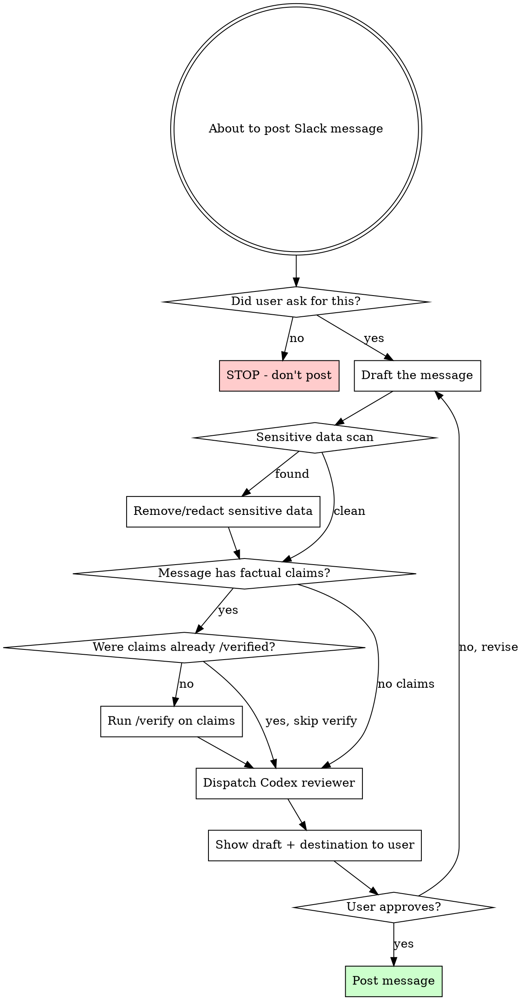

# Post Slack Message

## Overview

**Mandatory gate before every Slack message.** Verify claims, scan for sensitive data, confirm destination, and get independent Codex review before posting anything to Slack.

## When to Use

**Every time** you are about to call `slack_send_message`, `slack_send_message_draft`, or `slack_schedule_message`. No exceptions.

## The Gate



## Instructions

### Step 1: Confirm User Intent

Before anything else — did the user explicitly ask you to post this message? Not implied, not "would be helpful", not proactive. **Explicitly asked.**

If no: stop. Do not post. Do not ask "would you like me to post this?" unprompted.

### Step 2: Draft the Message

Write the full message text and identify:

- **Destination:** channel name/ID, thread timestamp (if reply)
- **Recipients:** any @mentions or DM targets

### Step 3: Sensitive Data Scan

Scan the draft for anything that looks sensitive:

| Category           | Examples                                                 |
| ------------------ | -------------------------------------------------------- |
| **Credentials**    | Passwords, API keys, tokens, connection strings          |
| **Infrastructure** | Internal hostnames, IPs, ports, DB names                 |
| **Personal**       | Performance reviews, salary, personal contact info       |
| **Business**       | Revenue numbers, unreleased product names, legal matters |
| **Auth artifacts** | Session tokens, cookies, JWTs, OAuth codes               |

If found: redact and replace with safe alternatives (e.g., "credentials are in Vault under `payments/prod`"). Tell the user what you removed and why.

**Do not dismiss infrastructure details as "low risk".** Internal hostnames, DB table names, cache technologies — flag them to the user and let them decide. Your job is to surface, not to judge risk.

### Step 4: Verify Factual Claims

**Skip this step if claims in the message were already verified with /verify earlier in this conversation.**

If the message contains factual claims about code, architecture, services, or behavior:

1. Extract each verifiable claim
2. Invoke /verify on those claims
3. If any claim is REFUTED or PARTIALLY TRUE — correct the message before proceeding
4. If UNCERTAIN — flag to the user and let them decide whether to include

### Step 5: Codex Independent Review

Dispatch Codex to independently review the message and destination:

```bash
mkdir -p /tmp/slack-review && codex exec --full-auto -m gpt-5.4-mini --skip-git-repo-check -o /tmp/slack-review/review.md "Review this Slack message for issues before posting.

MESSAGE:
<paste full message text>

DESTINATION: <channel/DM + thread if applicable>
CONTEXT: <1-2 sentences on what the conversation was about>

Check for:
1. Sensitive data (credentials, internal URLs, personal info, tokens)
2. Incorrect or misleading claims
3. Wrong audience (message content appropriate for this channel/person?)
4. Tone issues (too casual for incident channel? too formal for team chat?)
5. Missing context that would confuse readers

Report: List any issues found, or confirm 'No issues found' if clean."
```

Read the Codex output. If issues found, fix them before proceeding.

### Step 6: Present to User for Approval

Show the user:

```
**Posting to Slack:**
- Channel: #channel-name (or DM to @person)
- Thread: [if applicable]

**Message:**
> [full message text]

**Verification:**
- Sensitive data scan: Clean / [issues found and fixed]
- Claim verification: [verified/skipped/corrected]
- Codex review: [clean/issues fixed]

Send this?
```

**Do NOT post until the user explicitly approves.** "Looks good", "yes", "send it" = approval. Silence or ambiguity = do not send.

### Step 7: Post

Only now call the Slack tool.

## Red Flags — You're Skipping the Gate

| Thought                               | Reality                                                           |
| ------------------------------------- | ----------------------------------------------------------------- |
| "User said send it, I should be fast" | Speed doesn't matter. Accuracy does. Run the gate.                |
| "It's just a simple message"          | Simple messages leak credentials too. Run the gate.               |
| "I already checked mentally"          | Mental checks miss things. Use Codex.                             |
| "Codex is overkill for this"          | Codex takes 15 seconds. Undoing a bad Slack post takes forever.   |
| "The user will see it before I send"  | Step 6 is showing them. Steps 1-5 catch things they won't notice. |
| "I already verified the claims"       | Great — then Step 4 is a no-op. Still run Steps 3 and 5.          |
| "This is a draft, not a real post"    | Drafts become posts. Gate applies to drafts too.                  |

## Common Mistakes

| Mistake                                           | Fix                                                                       |
| ------------------------------------------------- | ------------------------------------------------------------------------- |
| Posting without user explicitly asking            | Step 1 is non-negotiable. User must ask.                                  |
| Skipping Codex because "message is simple"        | Always run Codex. It catches what you miss.                               |
| Re-verifying already-verified claims              | Check conversation history. If /verify ran, skip Step 4.                  |
| Showing draft without verification results        | User needs to see what checks were done (Step 6 format).                  |
| Posting to wrong channel because name was similar | Verify channel ID, not just name. Use `slack_search_channels` to confirm. |
